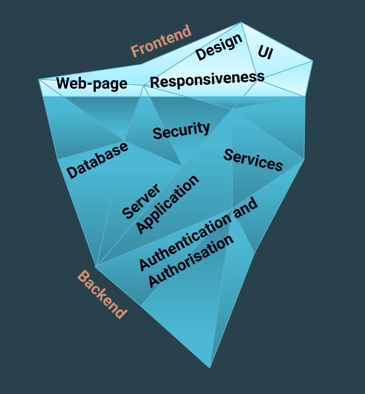
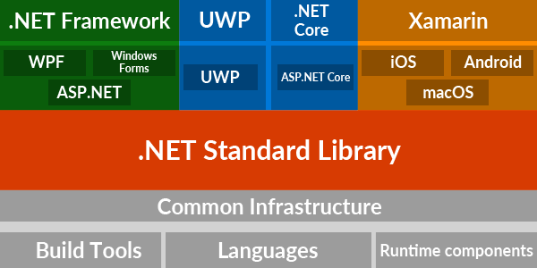

# Class 01 – Introduction to C# and Visual Studio 😊

**Trainer:** Martin Panovski  <br>
Contact: panovski.martin93@gmail.com

---

## HELLO THERE 👋

Welcome to the first backend class of the academy.

This class marks the transition from **Frontend** development to **Backend** development.  
We begin working with **C#** and **Visual Studio** and start building applications that run on the server side.

---

## Aims and Goals of This Course 🎯

The goals of this course are:
- Understanding the basics of the **C# language**
- Learning to use **Visual Studio**
- Solving problems in C# by building applications
- Writing a lot of C# code

---

## Where Are We Now? 🌍

You have just finished the **Frontend** part of the academy.

So far, you have a decent understanding of:
- HTML
- CSS
- JavaScript

You are able to build **frontend solutions** focused on:
- User Interface
- Design
- Responsiveness
- User interaction

A complete web solution consists of:

### Frontend
- UI
- Design
- Responsiveness
- User interaction

### Backend
- Server application
- Business logic
- Services
- Authentication and Authorization

### Database
- Data storage and management

Frontend is the visible part of the application, while backend is the foundation that users do not see.



🤖 Let’s ask AI  
> Explain frontend and backend development using an iceberg analogy.

---

## What Is C#? 💡

C# is:
- An **object-oriented programming language**
- Developed by **Microsoft**
- Runs on the **.NET Framework**

With C# we can build:
- Windows Client Applications
- Web Services
- Client-Server Applications
- Mobile Applications
- Cloud solutions

C# is a **compiled language**, meaning the code must be transformed before it can run.

🤖 Let’s ask AI  
> Explain what C# is to someone who already knows JavaScript.

---

## Object-Oriented Language 🧱

C# is an **Object-Oriented Programming (OOP)** language.

This means:
- All variables and methods are encapsulated within **classes**
- The `Main` method (application entry point) is part of a class
- Code is organized around objects

🤖 Let’s ask AI  
> Explain Object-Oriented Programming using a real-life example.

---

## .NET Framework ⚙️

.NET (dot net) is a **framework** that:
- Provides programming guidelines
- Is a platform for developing a wide range of applications
- Supports multiple programming languages:
  - C#
  - Visual Basic
  - C++
  - F#

The framework also:
- Manages memory
- Monitors performance
- Handles libraries and dependencies

Different versions of .NET:
- **.NET Framework** – Windows only
- **.NET Core** – Cross-platform
- **.NET 5+ / .NET** – Unified modern platform



🤖 Let’s ask AI  
> What role does .NET play when running a C# application?

---

## Visual Studio 🛠️

Visual Studio is a powerful tool built for developers.

### What Is Visual Studio?

Microsoft Visual Studio is an **Integrated Development Environment (IDE)** developed by Microsoft.

It is used to develop:
- Computer programs
- Web sites
- Web applications
- Web services
- Mobile applications

Visual Studio helps developers work:
- Faster
- More efficiently
- In a more organized way

🤖 Let’s ask AI  
> What problems does an IDE solve compared to writing code in a simple text editor?

---

## Solution and Project 📁

A **Solution**:
- Is a structure for organizing projects in Visual Studio
- Tracks dependencies
- Stores configurations

A **Project**:
- Is an entity that contains code and logic
- Produces an output
- Always exists inside a solution (even if there is only one project)

🤖 Let’s ask AI  
> Explain the difference between a solution and a project in Visual Studio. Please try to make it as simple as possible, give an example that is beginner friendly.

---

## Console Application 🖥️

A **Console Application**:
- Executes C# code
- Takes input from the command line
- Prints output in the console

The Console App template in Visual Studio:
- Is preconfigured
- Requires no additional setup
- Is ideal for learning the C# language

---

## Console Application Structure (pre .NET 6)

```csharp
using System;

namespace Calculator
{
    class Program
    {
        static void Main(string[] args)
        {
            // Your code goes here
        }
    }
}
```

---

## Console Application Structure (.NET 6+)

```csharp
using System;

// Your code goes here
```

This simplified structure removes boilerplate code, while the logic still exists in the background.

🤖 Let’s ask AI  
> Why are console applications a good starting point for learning C#?

---

## Writing in the Console ✍️

Writing to the console is similar to JavaScript console output.

```csharp
Console.WriteLine("Hello World!");
Console.Write("Hello World!");
Console.ReadLine();
```

---

## Exercises 🧪

### Exercise 1
Open Visual Studio and:
- Navigate to **File → New → Project**
- Select **Blank Solution**
- Add a **Console App (.NET Framework)** project

In the `Main` method write:

```csharp
Console.WriteLine("Hello World");
Console.ReadLine();
```

---

### Exercise 2
Create a new Console Application called **Stars** in the same solution.

Create a triangle using the `*` character.

Expected output:
```
    *
   ***
  *****
 *******
*********
```

---

### Exercise 3
Try to create a man using the `*` character.

Expected output:
```
     *
    ***
     *
    * *
   *   *

```

---

## Questions? ❓

If you have any questions during or after the class, feel free to ask.

All code examples and exercises can be found in the **GitHub repository** for this course.

---

## AI Usage During the Course 🤖

Throughout the course:
- **GitHub Copilot** will be used inside **Visual Studio**
- AI tools will be used during lectures and after classes
- AI is used to:
  - Better understand concepts
  - Ask clearer questions
  - Improve code quality

Always aim to **understand the code you write**, even when using AI assistance.
