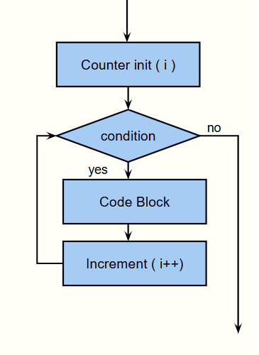
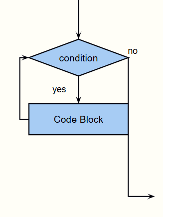
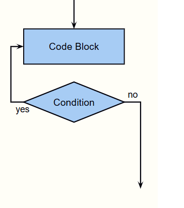

# Class 03 – Loops and Arrays 😉

**Trainer:** Risto Panchevski  <br>
Contact: risto.panchevski@gmail.com

---

## AGENDA FOR THIS CLASS 📋
Looping in C# with:
- For
- While
- Do-While
- ForEach

Arrays in C#
- Array methods
- Using Loops and Arrays
- Console tricks with loops

---

## Loops

Repeating code multiple times is nothing new in programming and almost every programming language implements this feature in a pretty similar way. In C# there are also looping structures and they are very similar to some standard looping structures in programming.

A loop statement allows us to execute a statement or multiple statements, a certain amount of times in a programming language.


---

## Loop Types
We can do looping in C# with the following features:
- for
- while
- do-while
- foreach (only with arrays)

---

## For



```csharp
Console.WriteLine("Counting to 10...");
for(int i = 1; i <= 10; i++){
  Console.WriteLine("Counter is now:" + i);
}
Console.WriteLine("Done counting!");
Console.ReadLine();
```

🤖 Let’s ask AI  
> Explain the parts of the for loop in C#: initialization, condition, increment. Expalin them in a beginner friendly format with as many examples as possible.

---

## While



```csharp
Console.WriteLine("Counting to 10...");
int j = 1;
while(j <= 10){
  Console.WriteLine("Counter is now:" + j);
  j++;
}
Console.WriteLine("Done counting!");
Console.ReadLine();
```

---

## Do-While

Do-While loop will guarantee at least one execution of the Code Block.  
Do-While loop has a condition (checked after the block).  
Must declare counters outside the block.



```csharp
int counter = 1;
do
{
  Console.WriteLine(counter);
  counter++;
}
while(counter <= 5);
```

---

## Break / Continue

Used for breaking out of the loop:
- **break**: exits the loop entirely (code after break not executed)
- **continue**: skips current cycle, continues with next iteration

---

## EXERCISE 1

Get an input number from the console  
Print all numbers from 1 up to that number  

Get another input number from the console  
Print all numbers starting from that number up to 1  

Get an input number from the console  
Print all even numbers starting from 2  

Get another input number from the console  
Print all odd numbers starting from 1  

---

## EXERCISE 2

Get an input from the console  
Print all numbers from 1 to that number  

Don’t print numbers that can be divided by 3 or 7  

If we get 100 prints:  
**The limit is reached**  
and stop counting  

---

## Arrays

The need for storing multiple values in one place is usually solved in programming languages with Arrays. These structures are present in C# and we are going to use them in the following classes. C# also has other collection types, but we will learn about them later in the subject. Arrays in C# are strict as everything else and we must always tell the array with what type it will be filled. We can't have an array with different values with different data types. Also, the length of the array is fixed and it stays the same while we are working with it. The only way to change it is to change the max number of items the array can hold.

Arrays in C# are basically collection of fixed number of variables of the same type. We use arrays when we want to store a certain number of values as a group.


---

## Array Properties

When we create an array we must specify the type of the array.  
When we create an array we must specify the number of elements it will hold.  
Items in an array are indexed starting from 0.  
Access and change items by accessing their index.
---

## Creating an array

```csharp
// Creating a new array with 2 items 
int[] intArray1 = new int[2];
intArray[0] = 2;
intArray[1] = -20;
```

```csharp
int[] intArray2 = new int[] {2, -20};
```

```csharp
int[] intArray2 = {2, -20};
```

🤖 Let’s ask AI  
> Why do arrays in C# have a fixed size and what problems does that solve?

🤖 Let’s ask AI  
> Explain why array indexing starts from 0 and what happens if we try to access an index that does not exist.

---

## Working with Arrays (Array methods)

We can get the number of items in an array using the property length. We can find a value in Array with the method IndexOf. We can also reverse an array with Reverse. We can change an array number of items with Resize.


```csharp
double[] doubleArray  =  new  double[] { 2.4, 11, 12, 634, 0.99 };
// Reversing array
Array.Reverse(doubleArray);

// Finding something in an array
int indexFound = Array.IndexOf(doubleArray, 12);
Console.WriteLine(indexFound);
int indexNotFound = Array.IndexOf(doubleArray, 5.5);
Console.WriteLine(indexNotFound);

// Change an array number of items
Array.Resize(ref doubleArray, 6);
doubleArray[5] = 105.6;
Console.WriteLine(doubleArray[5]);
Console.ReadLine();
```

---

## Looping arrays using for()

```csharp
string[] names = new string[] {"Bob", "Jill", "Greg"};
Console.WriteLine("Writing names...");
for(int i = 0; i < names.Length; i++){
  Console.WriteLine(names[i]);
}
Console.ReadLine();
```

---

## Foreach Loop

A loop that loops only when provided an array.  
Loops through every element of an array.  
Stores elements in a local variable.  
Break and continue apply as well.

```csharp
string[] names = new string[] {"Bob", "Jill", "Greg"};
Console.WriteLine("Writing names...");
foreach(string name in names){
  Console.WriteLine(name);
}
Console.ReadLine();
```

---

## EXERCISE 3

Declare 5 arrays with 5 elements in them:
- With words
- With decimal values
- With characters from keyboard
- With true/false values
- With arrays, each holding 2 whole numbers

---

## EXERCISE 4

Declare a new array of integers with 5 elements  
Initialize the array elements with values from input  
Sum all the values and print the result in the console  

---

## EXERCISE 5

Create an array with names  
Give an option to the user to enter a name from the keyboard  
After entering the name put it in the array  
Ask the user if they want to enter another name(Y / N)  
Do the same process over and over until the user enters N  
Print all the names after user enters N  

---


## Extra Materials 📘

* [Official Microsoft documentation for arrays](https://docs.microsoft.com/en-us/dotnet/csharp/tour-of-csharp/arrays)  
* [.NET Pearls - Arrays](https://www.dotnetperls.com/array)

---

## Questions? ❓

If you have any questions during or after the class, feel free to ask.

All code examples and exercises can be found in the **GitHub repository** for this course.

## AI Usage During the Course 🤖
Throughout the course:
- **GitHub Copilot** will be used inside **Visual Studio**
- AI tools are used as support during lectures

Always make sure you **understand the code you write**, even when using AI assistance.
